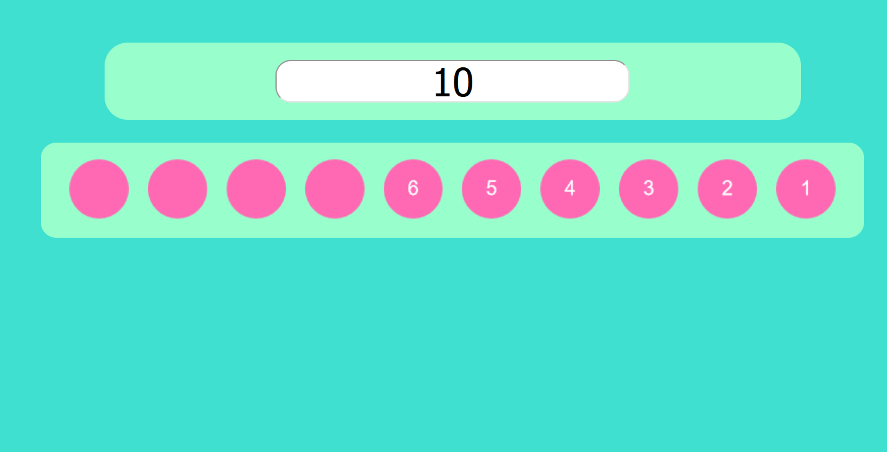

# Counting and Shape for Kids Website

Welcome to the Counting and Shape for Kids website! This is a fun and educational platform designed to help children learn about counting and shapes in an interactive way.

## About the Website
This website is still in develobment for interacting with shapes
## Features
- Clickable shapes for counting
- Basic arithmetic operations can be done (adding, subtracting, multiplying, dividing)
- Colorful visuals
- Easy-to-use interface for kids

## Website Link
You can access the website by clicking [here](https://retenuphilistia13.github.io/counting_and_shape_for_kids/). Have fun exploring and learning with your kids!

## License
This website and its content are under [MIT License](LICENSE), allowing you to use, modify, and distribute the content while giving appropriate attribution.

## Contact
For any inquiries or questions, you can reach us at [ahmedabusweireh@outlook.com](ahmedabusweireh@outlook.com).

